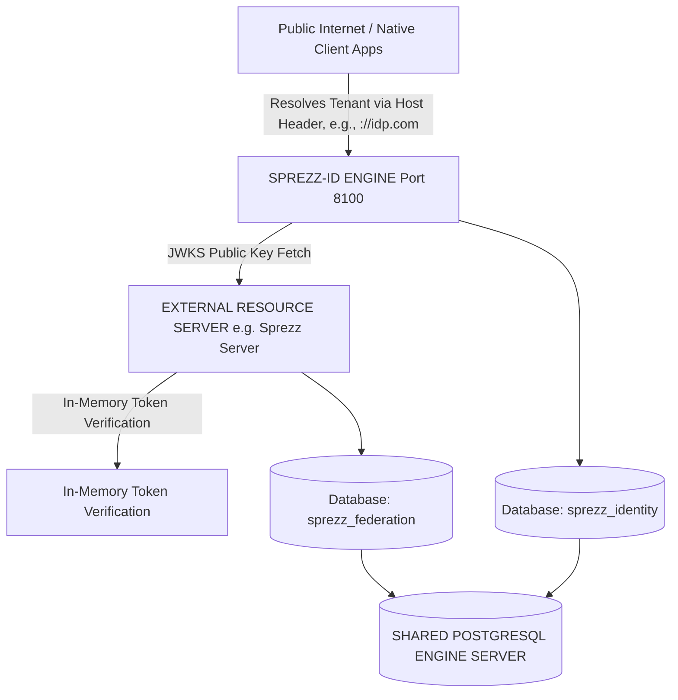
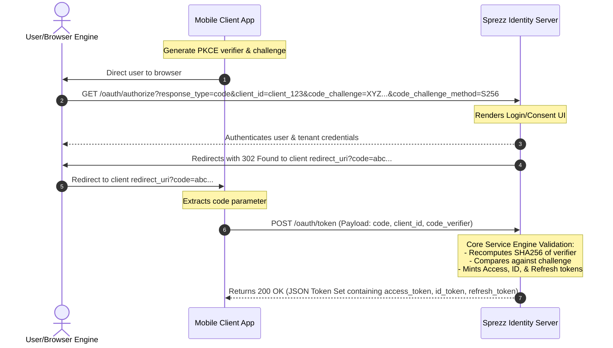

# Architecture Blueprint: Sprezz Identity Server

This document establishes the definitive functional and technical architectural blueprint for **Sprezz Identity**, a standalone, high-performance Identity Provider (IdP) and Token Server. This system is engineered completely independently of any specific resource application, adheres strictly to **Hexagonal Architecture (Ports and Adapters)** principles, and natively provides multi-tenant execution boundaries.

The server implements **OAuth 2.0 with PKCE**, **OpenID Connect (OIDC)**, and **Dynamic Client Registration (DCR)** using concurrent dual-asymmetric cryptographic signatures (**RS256** and **EdDSA**).

## 1. Global Topology & Boundary Context

Sprezz Identity operates as a decentralized, zero-trust cryptographic boundary layer. It strictly decouples user identity and authentication domains from downstream resource business logic.



## 2. Microservice Project Structure

The project topology forces strict perimeter isolation. Core business logic cannot contain dependencies on database drivers, HTTP web engines, or external serialization layers.

```text
sprezz-identity/
├── cmd/idp/
│   └── main.go                         # Infrastructure entrypoint & dependency wire-up
├── docs/
│   └── architecture_blueprint.md       # This specification document
├── internal/
│   ├── config/                         # Configuration loaders & Asymmetric Key parsers
│   ├── domain/                         # CORE BUSINESS LOGIC (Pure Go, 0 external imports)
│   │   ├── model/                      # Pure Domain Entities (Tenant, Account, App, Token)
│   │   ├── port/                       # Driving and Driven Structural Interfaces
│   │   └── service/                    # Business Engines (OAuth, ClientRegistration, PKCE)
│   └── adapters/                       # INFRASTRUCTURE WIRE-UP (Ports fulfillment)
│       ├── in/
│       │   └── http/                   # Framework endpoints, route handlers, payload parsers
│       └── out/
│           ├── postgres/               # Relational persistence layer via sqlc
│           │   ├── db/                 # Auto-generated code structures from SQL queries
│           │   ├── migrations/         # DDL transactional schema scripts (.sql)
│           │   └── query/              # Raw database lookup scripts (.sql)
│           └── crypto/                 # Asymmetric signature engines (JWT minting / JWKS building)
├── Dockerfile                          # Multi-stage scratch minimal build environment
├── go.mod
└── sqlc.yaml                           # Custom SQL compiler configuration for identity scope
```

## 3. Pure Domain Model Strategy (`internal/domain/model/`)

All domain entities use native Go primitives. They remain entirely un-annotated by framework database tags, validation micro-framework anchors, or JSON serialization metadata to safeguard domain core purity.

* **`tenant` Component**: Holds internal high-entropy tracking keys, human-readable organization identifiers, and structural canonical tracking domains.
* **`crypto_types` Component**: Maintains definitions for asymmetric algorithms (`RS256` / `EdDSA`) and structure maps for signing key registries.
* **`client_application` Component**: Governs client applications, registration secrets, white-listed redirect URIs, permitted grant/response arrays, and targeted encryption bindings.
* **`auth_session` Component**: Manages temporal storage variables during active validation lifecycles, locking active PKCE challenge state matrices down to explicit users.
* **`oidc_claims` Component**: Handles structural schemas tracking access token lifespans, standard dynamic payload values, and core user-profile field vectors.

## 4. Port Boundaries (`internal/domain/port/`)

Ports define the rigid, un-compromised structural abstract contracts of the system boundary.

### Inbound Ports (Driving / Use Cases)

* **Dynamic Client Registration Contract**: Controls external client engine enrollment processing, mapping unauthenticated registration data to targeted entity spaces safely.
* **OAuth Flow Contract**: Governs authorization state allocations and structural authorization code trade workflows.
* **Tenant Resolution Contract**: Maps routing lookups using inbound layer variables down to verified workspace contexts.

### Outbound Ports (Driven / Infrastructure)

* **Identity Storage Contract**: Abstracts state interactions, decoupling the business engine from physical databases for clients, sessions, and profile tracking.
* **Asymmetric Crypto Engine Contract**: Encapsulates token minting tasks, raw payload cryptographic signing, and public signature set distributions.
* **Clock Contract**: Abstracts time generation to ensure deterministic service calculations, support precise unit testing of temporal boundaries (e.g. token expirations), and resolve sub-second database/JWT comparison flakiness.

## 5. Specification Flow Control Matrix

### A. Dynamic Client Registration (DCR - RFC 7591)

Enables native apps (like mobile clients or single-page applications) to register themselves dynamically over an unauthenticated boundary.

* **Rule 1 (Public Client Stripping)**: If the registration payload specifies a native mobile or browser client application type, the engine **must not** generate or return a `client_secret`. The application profile is saved with a null secret and locked out of standard client-credential grant executions.
* **Rule 2 (Scope Filtering)**: The registration engine matches requested scopes against the tenant's predefined list of allowed scopes (`PredefinedScopes`) before committing the client application registration.

### B. Authorization Code Flow with PKCE (RFC 7636)

Protects public, native mobile clients from intercept attacks by forcing runtime cryptographic proofs.



The mathematical evaluation inside the business layer service strictly asserts:
$$\text{Base64URL}(\text{SHA256}(\text{code\_verifier})) == \text{code\_challenge}$$

### C. Domain-Based Tenant Resolution Workflow

To allow human users and automated clients to interact seamlessly with their specific identity container without passing raw system UUID parameters over wire query variables:

1. The Inbound HTTP Adapter intercepts the browser connection flow at `/oauth/authorize`.
2. The middleware inspects the incoming request's `r.Host` parameter (e.g., `localhost:8100`).
3. The server calls the `TenantResolutionUseCase`, driving an immediate O(1) indexed lookup against the persistence layer.
4. If valid, the engine assigns the specific `TenantID` directly to the running context thread (`context.Context`), locking all downstream logins, clients, and cryptographic signatures to that partition.

## 6. Multi-Tenant Relational Identity Schema Strategy

The persistence architecture isolates records by forcing a primary composite multi-tenant index lock across all lookup rows.

* **`tenants` Engine Domain**: Isolates the global identity landscapes. Employs a partial index on domains to provide zero-latency workspace routing for active accounts.
* **`applications` Engine Domain**: Stores tenant client details. Includes an algorithm identifier (`RS256` or `EdDSA`) and tracks application details via primary composite multi-tenant matrix structures.
* **`auth_sessions` Engine Domain**: Tracks high-entropy short-lived validation codes, state parameters, scopes, and expirations.

Internally a tenant is represented by an integer, externally (inside tokens for example) by a UUIDv4.

### 6.1 Accidental Cascade Delete Prevention (The Cascade Delete Trap)

To safeguard critical security audit trails and history files against accidental tenant deletion, Sprezz Identity implements strict database-level referential integrity checks:

* **Strict Constraint Enforcement**: The `audit_event_log` table references the `tenants` table with an `ON DELETE RESTRICT` constraint instead of `ON DELETE CASCADE`.
* **Security & Auditing Protection**: Physical tenant hard-deletion is blocked by the engine if the tenant has associated audit log records, ensuring that historical security trails can never be deleted or purged as an unintended cascade side-effect.
* **Soft-Deletions**: Rather than hard-deleting tenant schemas, deactivation is performed by setting the soft-delete marker `is_active = FALSE`. This preserves all underlying logs, client records, and blacklists.

## 7. Cryptographic Strategy & Universal JWKS Layout

Sprezz Identity implements concurrent asymmetric dual-signing. It uses an internal Key Registry pattern mapping keys by Key ID (`kid`) and signature algorithm type (`alg`).

* **Egress Token Evaluation**: When minting tokens, the service queries the application profile. If `idp_signing_algorithm` matches `EdDSA`, it utilizes the **Ed25519** signing key to yield sub-millisecond encryption footprints. If it matches `RS256`, it applies the **RSA-2048** key for backwards-compatibility.
* **The Single-GET JWKS Route**: The infrastructure exposes `/.well-known/jwks.json`, grouping both signatures into an immutable pre-computed memory byte array.
* **Dynamic OIDC Issuer Claim Matching**: When minting an identity payload certificate (the ID Token), the crypto engine no longer pushes a static server-wide root domain string. It reads the specific resolved tenant parameters to generate distinct, isolated identity issuers dynamically matching the client's origin (e.g., `"iss": "https://idp.com"`).
* **The `"tid"` Tenant ID Claim**: Every minted Access Token and ID Token contains a **`"tid"` (Tenant ID) claim** populated with the string representation of the resolved Tenant UUIDv4, allowing downstream resource servers to perform stateless, multi-tenant boundary checks.

## 8. Protocol Compliance Interface Map

To maintain complete compatibility with off-the-shelf native app clients, the HTTP Inbound Adapter layer translates protocol transport wire conventions down to domain primitives.

1. **Scope Tokenization Check**: On the HTTP wire, scopes pass as space-delimited string vectors (`"openid profile email"`). The inbound controller must intercept this parameter and tokenize it immediately, routing only a pure Go slice array to the ports layer.
2. **Extended Boundary Constraints**: The IDP serves strictly as an access gatekeeper mapping identities down to an un-alterable `sub` URI or resource pointer. It **does not** function as an expansive CRM, contact manager, or corporate directory table. Any future requirement for semantic contact mapping via RDF or triple stores must reside in an entirely detached, isolated application container.

### Token Endpoint Route Requirements

| Route Endpoint | HTTP Method | RFC/Specification Context | Functional Responsibility |
| :--- | :--- | :--- | :--- |
| `/.well-known/openid-configuration` | `GET` | OpenID Discovery 1.0 | Aggregates all protocol server metadata paths and crypto capabilities. |
| `/.well-known/jwks.json` | `GET` | RFC 7517 (JWK) | Distributes concurrent public signing parameters to external servers. |
| `/oauth/register` | `POST` | RFC 7591 (DCR) | Executes dynamic onboard profiles for untrusted mobile native clients. |
| `/oauth/authorize` | `GET`/`POST` | RFC 6749 / RFC 7636 | Orchestrates credentials authentication, tenant isolation, and consent UI. |
| `/oauth/token` | `POST` | RFC 6749 / PKCE Swap | Validates verifiers, confirms code constraints, and issues the token payload. |
| `/oauth/revoke` | `POST` | RFC 7009 | Revokes an active Access Token or Refresh Token (adds JTI to database-backed blacklist). |
| `/oauth/introspect` | `POST` | RFC 7662 | Validates cryptographically and checks the status of an active Access Token (or Refresh Token). |
| `/oauth/logout` | `GET` | OIDC Session 1.0 | Log out the user, clear IDP cookies, and propagate Single Logout to active clients. |
| `/oauth/userinfo` | `GET` | OIDC Core 1.0 | Authenticated user profile retrieval interface (`Authorization: Bearer`). |
| **Dynamic Routing Middleware** | `Intercept` | HTTP Host Header Context | Resolves incoming raw server domains (`Host`) to a valid internal `tenant_id` state. |

## 9. Multi-Tenant Identity Providers & Identity Coupling

Sprezz Identity natively supports multiple, decoupled identity providers per tenant. This model cleanly separates user authentication mechanisms from the core user identity boundary.

### 9.1 Architectural Domain Model

* **User Profile**: A singular representation of the human identity within a tenant, identified by a UUIDv4. It holds standard claim values (display name, email address, verification status).
* **Identity Provider (IdP)**: A configured mechanism of authentication for a tenant (e.g., `"username-password"`, and future OIDC/SAML configurations).
* **User Identity**: A verified coupling record mapping a User Profile to a specific Identity Provider. Successful authentication on an IdP couples that user profile to the identity. It tracks:
  * `coupled_at` (First login/coupling time)
  * `last_login_at` (Last login time)
  * `login_count` (Logins tally)
  * `external_identity_id` (Unique subject ID from the provider; for `"username-password"` it maps to the User Profile UUID; for future federated IdPs, it maps to their external `sub` claim).

### 9.2 Client-Level IdP Access Controls

To support granular security policies, Client Applications govern IdP execution:

* **Allowed IdPs**: A client configuration option specifying which IdP aliases are permitted for authentication.
* **Default IdP**: The default IdP alias utilized when no explicit choice is specified.
* **IDP Hint (`idp_hint`)**: Client applications can bypass general selection by specifying an explicit IdP alias via the `idp_hint` authorize query parameter. The server strictly asserts that the hint exists within the client's allowed IdPs list.

### 9.3 Secure Pre-Authentication Interaction Sessions

To maintain architectural purity, separation of concerns, and clean views:

1. When `/oauth/authorize` is accessed unauthenticated, the server instantiates a high-entropy, short-lived `interaction_sessions` record (referencing a native UUID primary key) to store the incoming OAuth context (`client_id`, `redirect_uri`, `code_challenge`, etc.).
2. The server sets a secure, HTTP-only, short-lived session cookie containing ONLY the session UUID (`spz_auth_session_id`) and redirects to `/`.
3. The login view template (`login.templ`) is completely decoupled and receives zero OIDC parameters.
4. Upon successful credential validation, the server consumes (and deletes) the interaction session, clears the cookie, and seamlessly completes the authorization code grant code swap.

### 9.3.1 Content Security Policy & Cryptographic Nonce Propagation

To mitigate Cross-Site Scripting (XSS) and injection vectors on server-rendered pages (e.g., login and logout forms):

* **Strict CSP Header**: Every user-facing UI route serves a strict `Content-Security-Policy` header:
  `default-src 'self'; script-src 'self' 'nonce-[nonce]' https://unpkg.com; style-src 'self' 'unsafe-inline'; frame-src 'self' *`
* **Secure Per-Request Nonce Generation**: A dedicated HTTP middleware generates a secure, high-entropy 16-byte cryptographically random value (using `crypto/rand` and base64-encoded) for every request.
* **Contextual Nonce Injection**: The middleware injects this unique nonce into the request context via `templ.WithNonce(ctx, nonce)`. The `a-h/templ` rendering system automatically extracts this nonce and applies the `nonce="..."` attribute to all `<script>` blocks (such as those in `login.templ` and `logout.templ`), satisfying the browser's strict script execution safety checks.

### 9.4 Cryptographic Argon2id Storage

The `"username-password"` provider stores credentials utilizing Argon2id in a standard PHC-formatted string:
`$argon2id$v=19$m=65536,t=3,p=2$salt$hash`
This format inherently prefixes the signature algorithm identifier, ensuring smooth algorithm migration support in the future.

### 9.5 Token Revocation, Stale Session and Interaction Session Pruning (Redefined to 15-Minute Ticks)

Sprezz Identity implements RFC 7009 Token Revocation to invalidate stateless JWT access tokens prior to their physical cryptographic expiration. To maintain O(log N) indexing speeds and prevent Postgres index degradation, a background cleanup routine periodically prunes stale data.

* **The Blacklist Mechanism**: Revoking a token parses its unique JWT ID (`jti` / `TokenID`) and commits the `token_id` alongside its absolute expiration timestamp (`expires_at`) into a PostgreSQL-backed `revoked_tokens` table.
* **Introspection Verification**: Any cryptographic validation or introspection checks assert that the token's `jti` is not present within the active revoked blacklist database.
* **Automated Periodic Pruning (15-Minute Ticks)**: Because revoked tokens and session records naturally become invalid once they pass their `expires_at` timestamp, storing them is redundant and degrades index performance. A background pruning worker, running on 15-minute ticks (configured via `TokenPruningInterval` in `IdentityServerConfig`), executes bulk-pruning deletes to purge expired rows from `revoked_tokens`, `auth_sessions`, and `interaction_sessions`:

  ```sql
  DELETE FROM revoked_tokens WHERE expires_at <= NOW();
  DELETE FROM auth_sessions WHERE expires_at <= NOW();
  DELETE FROM interaction_sessions WHERE expires_at <= NOW();
  ```

### 9.6 Token Introspection (RFC 7662)

Sprezz Identity exposes standard RFC 7662 Token Introspection at the POST endpoint `/oauth/introspect`.

* **Cryptographic Integrity**: The token server verifies the signature of the incoming token using the tenant's public key (retrieved by matching the token's header `kid`).
* **Active Evaluation**: The server dynamically asserts that the token:
  1. Has a valid signature.
  2. Is not expired (`time.Now().Before(expires_at)`).
  3. Is not blacklisted inside the database `revoked_tokens` table.
* **Metadata Response**: For active tokens, the endpoint returns a JSON payload containing:

  ```json
  {
    "active": true,
    "scope": "openid profile email",
    "client_id": "test-client",
    "sub": "user-uuid",
    "exp": 1740000000,
    "iat": 1730000000,
    "iss": "https://idp.com",
    "token_type": "Bearer",
    "tid": "tenant-uuid"
  }
  ```

  For invalid, revoked, or expired tokens, the server simply returns `{"active": false}`.

### 9.7 OIDC Front-Channel Logout 1.0

Sprezz Identity implements OIDC Front-Channel Logout 1.0 to clear browser cookie sessions across multiple logged-in client applications.

* **The Single Cookie `spz_session` & `"sid"` claim**: To comply with modern strict cookie policies, consent minimization guidelines, and simplify auditing, Sprezz Identity combines the active SSO session details into a single first-party cookie named `spz_session`. This cookie securely encapsulates the authenticated subject, identity provider, and a cryptographically stable, unique Session ID in the format `<subject_id>:<provider_id>:<sso_session_id>`.
* **The `"sid"` Session Claim**: Issued ID Tokens contain a unique, stable `"sid"` (Session ID) claim populated directly from the `sso_session_id` stored inside the single `spz_session` cookie. This links the client's token directly to the active login browser session, making back-channel session trackability possible.
* **The Iframe Rendering Flow**: Upon receiving a valid GET request at `/oauth/logout`, the HttpAdapter clears the `spz_session` cookie and queries the usecase for front-channel logout URLs. If present, it serves `views.Logout`, rendering a hidden `<iframe>` targeting each client's registered `front_channel_logout_uri`.
* **Robust Redirection Timout**: To guarantee browser navigation, the template implements a dual-timer scheme: an unconditional 2-second safety timeout coupled to a faster `window.onload` callback, ensuring a reliable user redirect to the validated `post_logout_redirect_uri` even if client endpoints are slow or offline.

### 9.8 OIDC Back-Channel Logout 1.0

Sprezz Identity implements OIDC Back-Channel Logout 1.0 to trigger secure, out-of-band single logout actions directly at client endpoints.

* **Cryptographic Token Verification**: The server generates a unique, cryptographically signed `logout_token` (JWT) for each client. This token contains the standard claims (`iss`, `sub`, `aud`, `iat`, `jti`) and the mandatory `events` claim:
  `"events": { "http://schemas.openid.net/event/back-channel-logout": {} }`
* **Non-Blocking Asynchronous Propagation**: To keep logout execution extremely fast for the browser, the usecase invokes our SSRF-protected `port.LogoutNotifier` adapter asynchronously inside separate background goroutines, shielding client-to-server HTTP request times from the user.

## 10. Audience Governance and Token Minting

Sprezz Identity implements Audience Governance to restrict the intended recipients (Resource Servers) of minted Access Tokens and ensure least privilege access.

### 10.1 Tenant-Level Predefined Audiences

To enforce centralized security policy, Tenants configure a master list of trusted resource audiences (`PredefinedAudiences []string`). This ensures that only authorized resource API identifiers can be introduced into the identity partition.

### 10.2 Client-Level Allowed Audiences

Client Applications govern access to these APIs using `AllowedAudiences []string`. The system enforces that a client's allowed audiences list must be a subset of the tenant's predefined audiences. When an access token is minted, the token's `"aud"` claim is populated using the configured allowed audiences, restricting the token's validity to only the authorized resource servers.
