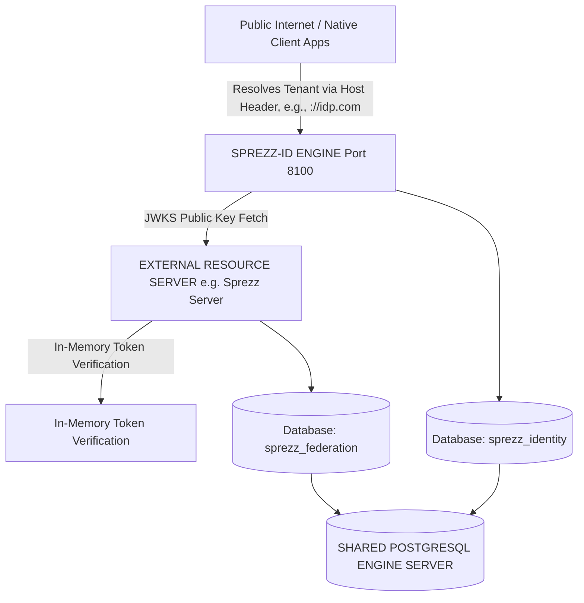
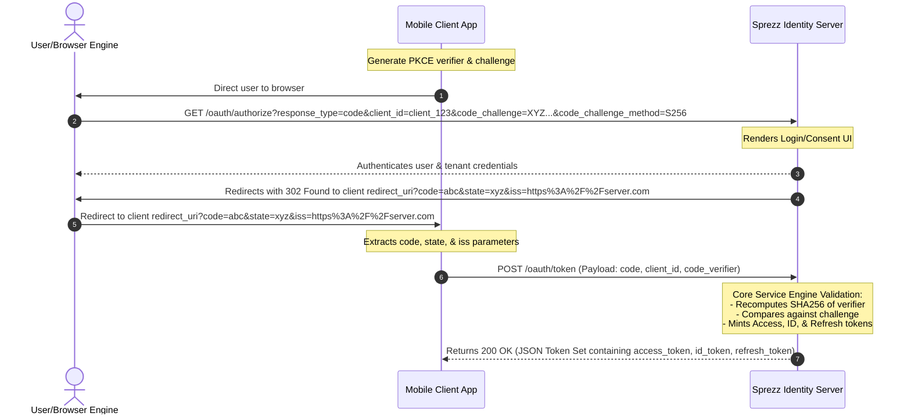

# Architecture Blueprint: Sprezz Identity Server

This document establishes the definitive functional and technical architectural blueprint for **Sprezz Identity**, a standalone, high-performance Identity Provider (IdP) and Token Server. This system is engineered completely independently of any specific resource application, adheres strictly to **Hexagonal Architecture (Ports and Adapters)** principles, and natively provides multi-tenant execution boundaries.

The server implements **OAuth 2.0 with PKCE**, **OpenID Connect (OIDC)**, and **Dynamic Client Registration (DCR)** using concurrent dual-asymmetric cryptographic signatures (**RS256** and **EdDSA**).

## 1. System Foundation & Project Topology

### 1.1 Global Topology & Boundary Context

Sprezz Identity operates as a decentralized, zero-trust cryptographic boundary layer. It strictly decouples user identity and authentication domains from downstream resource business logic.



### 1.2 Microservice Project Structure

The project topology forces strict perimeter isolation. Core business logic cannot contain dependencies on database drivers, HTTP web engines, or external serialization layers.

```text
sprezz-identity/
├── cmd/sprezz-identity/
│   └── main.go                         # Infrastructure entrypoint & dependency wire-up
├── docs/
│   ├── admin_blueprint.md              # Administrator control panel specifications
│   └── architecture_blueprint.md       # Functional and technical specs of the IdP engine
├── internal/
│   ├── config/                         # Configuration loaders & environment mappings
│   ├── domain/                         # CORE BUSINESS LOGIC (Pure Go, 0 external imports)
│   │   ├── model/                      # Pure Domain Entities (Tenant, UserProfile, UserIdentity)
│   │   ├── port/                       # Driving and Driven Structural Interfaces & Mocks
│   │   └── service/                    # Business Engines (OAuth, IdentityProvider, ClientApp)
│   ├── views/                          # UI View Layers (Server-Rendered Templ components)
│   │   ├── admin/                      # Admin administration forms and dashboard layout
│   │   └── public/                     # Public login, signup, and profile templates
│   ├── pkg/                            # Shared package components
│   │   └── httpclient/                 # Secure, SSRF-protected HTTP request worker
│   └── adapters/                       # INFRASTRUCTURE WIRE-UP (Ports fulfillment)
│       ├── in/
│       │   └── http/                   # HTTP endpoints, session cookies, route handlers
│       └── out/                        # Outbound persistence and clock dependencies
│           ├── clock/                  # Deterministic chronological time adapter
│           ├── crypto/                 # RS256 & EdDSA dynamic token signature engines
│           ├── logout/                 # Out-of-band asynchronous logout propagations
│           ├── memory/                 # Transient in-memory repository mock persistence
│           ├── state/                  # Context and local lifecycle structures
│           └── postgres/               # Relational persistence layer via sqlc & pgx
│               ├── db/                 # Auto-generated relational model structures
│               ├── migrations/         # Goose transactional DDL migration scripts (.sql)
│               └── query/              # Raw database queries and lookup statements (.sql)
├── Dockerfile                          # Multi-stage scratch minimal container workspace
├── go.mod                              # Go module specifications
├── Makefile                            # Multi-target build and test orchestrations
└── sqlc.yaml                           # Custom SQL compiler configurations
```

### 1.3 Pure Domain Model Strategy (`internal/domain/model/`)

All domain entities use native Go primitives. They remain entirely un-annotated by framework database tags, validation micro-framework anchors, or JSON serialization metadata to safeguard domain core purity.

* **`tenant` Component**: Holds internal high-entropy tracking keys, human-readable organization identifiers, and structural canonical tracking domains.
* **`crypto_types` Component**: Maintains definitions for asymmetric algorithms (`RS256` / `EdDSA`) and structure maps for signing key registries.
* **`client_application` Component**: Governs client applications, registration secrets, white-listed redirect URIs, permitted grant/response arrays, and targeted encryption bindings.
* **`auth_session` Component**: Manages temporal storage variables during active validation lifecycles, locking active PKCE challenge state matrices down to explicit users.
* **`oidc_claims` Component**: Handles structural schemas tracking access token lifespans, standard dynamic payload values, and core user-profile field vectors.

### 1.4 Port Boundaries (`internal/domain/port/`)

Ports define the rigid, un-compromised structural abstract contracts of the system boundary.

### Inbound Ports (Driving / Use Cases)

* **Dynamic Client Registration Contract**: Controls external client engine enrollment processing, mapping unauthenticated registration data to targeted entity spaces safely.
* **OAuth Flow Contract**: Governs authorization state allocations and structural authorization code trade workflows.
* **Tenant Resolution Contract**: Maps routing lookups using inbound layer variables down to verified workspace contexts.

### Outbound Ports (Driven / Infrastructure)

* **Identity Storage Contract**: Abstracts state interactions, decoupling the business engine from physical databases for clients, sessions, and profile tracking.
* **Asymmetric Crypto Engine Contract**: Encapsulates token minting tasks, raw payload cryptographic signing, and public signature set distributions.
* **Clock Contract**: Abstracts time generation to ensure deterministic service calculations, support precise unit testing of temporal boundaries (e.g. token expirations), and resolve sub-second database/JWT comparison flakiness.

## 2. Multi-Tenant Tenant Context & Database Persistence

### 2.1 Domain-Based Tenant Resolution Workflow

To allow human users and automated clients to interact seamlessly with their specific identity container without passing raw system UUID parameters over wire query variables:

1. The Inbound HTTP Adapter intercepts the browser connection flow at `/oauth/authorize`.
2. The middleware inspects the incoming request's `r.Host` parameter (e.g., `localhost:8100`).
3. The server calls the `TenantResolutionUseCase`, driving an immediate O(1) indexed lookup against the persistence layer.
4. If valid, the engine assigns the specific `TenantID` directly to the running context thread (`context.Context`), locking all downstream logins, clients, and cryptographic signatures to that partition.

### 2.2 Multi-Tenant Relational Identity Schema Strategy

The persistence architecture isolates records by forcing a primary composite multi-tenant index lock across all lookup rows.

* **`tenants` Engine Domain**: Isolates the global identity landscapes. Employs a partial index on domains to provide zero-latency workspace routing for active accounts.
* **`applications` Engine Domain**: Stores tenant client details. Includes an algorithm identifier (`RS256` or `EdDSA`) and tracks application details via primary composite multi-tenant matrix structures.
* **`auth_sessions` Engine Domain**: Tracks high-entropy short-lived validation codes, state parameters, scopes, and expirations.

Internally a tenant is represented by an integer, externally (inside tokens for example) by a UUIDv4.

### 2.3 Accidental Cascade Delete Prevention (The Cascade Delete Trap)

To safeguard critical security audit trails and history files against accidental tenant deletion, Sprezz Identity implements strict database-level referential integrity checks:

* **Strict Constraint Enforcement**: The `audit_event_log` table references the `tenants` table with an `ON DELETE RESTRICT` constraint instead of `ON DELETE CASCADE`.
* **Security & Auditing Protection**: Physical tenant hard-deletion is blocked by the engine if the tenant has associated audit log records, ensuring that historical security trails can never be deleted or purged as an unintended cascade side-effect.
* **Soft-Deletions**: Rather than hard-deleting tenant schemas, deactivation is performed by setting the soft-delete marker `is_active = FALSE`. This preserves all underlying logs, client records, and blacklists.

## 3. Identity Providers, User Profiles & Authentication

### 3.1 Multi-Tenant Identity Providers & Identity Coupling

Sprezz Identity natively supports multiple, decoupled identity providers per tenant. This model cleanly separates user authentication mechanisms from the core user identity boundary.

### 3.1.1 Architectural Domain Model

* **User Profile**: A singular representation of the human identity within a tenant, identified by a UUIDv4. It holds standard claim values (display name, email address, verification status).
* **Identity Provider (IdP)**: A configured mechanism of authentication for a tenant (e.g., `"username-password"`, and future OIDC/SAML configurations).
* **User Identity**: A verified coupling record mapping a User Profile to a specific Identity Provider. Successful authentication on an IdP couples that user profile to the identity. It tracks:
  * `coupled_at` (First login/coupling time)
  * `last_login_at` (Last login time)
  * `login_count` (Logins tally)
  * `external_identity_id` (Unique subject ID from the provider; for `"username-password"` it maps to the User Profile UUID; for future federated IdPs, it maps to their external `sub` claim).

### 3.1.2 Client-Level IdP Access Controls

To support granular security policies, Client Applications govern IdP execution:

* **Allowed IdPs**: A client configuration option specifying which IdP aliases are permitted for authentication.
* **Default IdP**: The default IdP alias utilized when no explicit choice is specified.
* **IDP Hint (`idp_hint`)**: Client applications can bypass general selection by specifying an explicit IdP alias via the `idp_hint` authorize query parameter. The server strictly asserts that the hint exists within the client's allowed IdPs list.

### 3.2 Cryptographic Argon2id Storage

The `"username-password"` provider stores credentials utilizing Argon2id in a standard PHC-formatted string:
`$argon2id$v=19$m=65536,t=3,p=2$salt$hash`
This format inherently prefixes the signature algorithm identifier, ensuring smooth algorithm migration support in the future.

### 3.3 Password Blocking and Lockout Safeguards

Sprezz Identity implements standard password blocking and lockout controls to safeguard user credentials against brute-force attacks.

* **Failed Attempts Logging**: The `VerifyPassword` service (utilised dynamically across login, email updates, and credential updates) logs every verification attempt. It updates the `last_verification_attempt` timestamp and increments `failed_verification_count` in the database upon failure.
* **Identity Blocking**: When `failed_verification_count` reaches a configured threshold (`max_failed_verification_count`, defaulting to `5` for local databases), the system marks the identity status as blocked (`blocked = true`). All subsequent verification attempts are rejected instantly while the block remains active.
* **Audited Successful Logins**: Upon a successful login, the authentication server updates the timestamp in `last_login_at` and increments the total verified login counts (`login_count`) in the database.
* **Temporal Lock Release (Cool-off window)**: To restore user access without administrator intervention, a temporary block automatically expires after the cool-off interval (`password_blocked_time`, defaulting to `900` seconds / 15 minutes). If the correct credentials are submitted after this cool-off window has elapsed, the identity is automatically unblocked, resetting `failed_verification_count` to `0`.
* **Strict Leak Prevention**: To prevent user enumeration or state leaks, all password verification and authentication failures consistently render the generic message `"Invalid username or password"` on the user interface. The server strictly suppresses any specific details indicating whether a password was wrong, the username was not found, or the account has been blocked.

## 4. User Sessions & Interactive Profile Management

### 4.1 Secure Pre-Authentication Interaction Sessions

To maintain architectural purity, separation of concerns, and clean views:

1. When `/oauth/authorize` is accessed unauthenticated, the server instantiates a high-entropy, short-lived `interaction_sessions` record (referencing a native UUID primary key) to store the incoming OAuth context (`client_id`, `redirect_uri`, `code_challenge`, etc.).
2. The server sets a secure, HTTP-only, short-lived session cookie containing ONLY the session UUID (`spz_auth_session_id`) and redirects to `/`.
3. The login view template (`login.templ`) is completely decoupled and receives zero OIDC parameters.
4. Upon successful credential validation, the server consumes (and deletes) the interaction session, clears the cookie, and seamlessly completes the authorization code grant code swap.

### 4.2 Content Security Policy & Cryptographic Nonce Propagation

To mitigate Cross-Site Scripting (XSS) and injection vectors on server-rendered pages (e.g., login and logout forms):

* **Strict CSP Header**: Every user-facing UI route serves a strict `Content-Security-Policy` header:
  `default-src 'self'; script-src 'self' 'nonce-[nonce]' https://unpkg.com; style-src 'self' 'unsafe-inline'; frame-src 'self' *`
  *(Note: Transitioning static assets to ahead-of-time (AOT) compiled Tailwind CSS via standard CLI builds allows dropping the `'unsafe-inline'` directive entirely, hardening the boundary to strictly source-locked styles).*
* **Secure Per-Request Nonce Generation**: A dedicated HTTP middleware generates a secure, high-entropy 16-byte cryptographically random value (using `crypto/rand` and base64-encoded) for every request.
* **Contextual Nonce Injection**: The middleware injects this unique nonce into the request context via `templ.WithNonce(ctx, nonce)`. The `a-h/templ` rendering system automatically extracts this nonce and applies the `nonce="..."` attribute to all `<script>` blocks (such as those in `login.templ` and `logout.templ`), satisfying the browser's strict script execution safety checks.

### 4.3 User Profile Dashboard & Custom Trust Verification

Sprezz Identity features a built-in user profile dashboard at `/profile` alongside secure credentials management forms for changing display name, email address, and account password. These resources operate under a strict, multi-tiered trust framework.

* **Profile Security Gating (AAL/IAL Checks)**: To enforce custom security requirements, the tenant's configuration manages trust thresholds for access:
  * `profile_aal`: The Authenticator Assurance Level (AAL) required to access the profile overview page (`/profile`).
  * `name_aal`: The AAL required to update the user's display name (`/profile/name`).
  * `email_aal`: The AAL required to change the account email address (`/profile/email`).
  * `password_aal`: The AAL required to change the user's password (`/profile/password`).
  * `default_ial`: The minimum Identity Assurance Level (IAL) required across all user-facing profile modification actions.
  * If a logged-in user's AAL/IAL levels derived from their active session IDP do not meet these thresholds, access is strictly blocked (yielding an HTTP `403 Forbidden` response).
* **Coupling Enforcement**: The user forms for name, email, and password changes are accessible *only* if the user's profile has an active, coupled identity linked to the `"username-password"` identity provider type.
* **Email Verification & Reset**: When a user changes their email address through the secure `/profile/email` subpage, the profile's `email_verified` status is instantly reset to `false` in transactional storage, invalidating previous verifications.
* **Credentials Hashing & Current Password Verification**: Password updates and email address changes mandate the submission and verification of the user's `current_password`. These checks are computed strictly inside the domain's `IdentityProviderService` using the Argon2id hashing algorithms before allowing any modifications.
* **Identity Decoupling**: Users can decouple connected identities. Decoupling invokes the `UserProfileService.DecoupleIdentity` domain method, safely removing the linked external identity from the tenant partition. This behavior is restricted by the `allow_decoupling` configuration field on the identity provider. When disabled (default for `username-password` credentials), decoupling is strictly prohibited, and the corresponding user interface options are hidden.

### 4.4 Trust Tiering: IAL, AAL, and ACR Mapping

Sprezz Identity implements OIDC-compliant trust tiering by introducing the concepts of **Identity Assurance Level (IAL)** and **Authenticator Assurance Level (AAL)**.

* **Assurance Assignments**: Every `IdentityProvider` configured under a tenant has assigned `IAL` and `AAL` levels (ranging from 1 - lowest, to 4 - highest) indicating the degree of confidence in authentication. By default, standard username-password logins carry an assurance level of `1`.
* **ACR Mapping Engine**: Tenant administrators configure a master lookup dictionary (`ACRToLevels`) mapping standard primitive string keys (e.g. `"aal2"` mapping to `{AAL: 2}`, `"ial3"` mapping to `{IAL: 3}`) to specific required IAL and AAL levels.
* **Complex Constraints Verification**: Requested OIDC Authentication Context Class References (ACR) passed via the `acr_values` query parameter (space-separated OR options, dash-separated AND options) or parsed securely from the OIDC JSON `claims` parameters are verified at runtime:
  * **Dynamic Decomposition of AND conditions**: Compound requested values joined by dashes (`"ial3-aal2"`) are parsed and decomposed dynamically into their primitive parts (`"ial3"` and `"aal2"`). Both constituent parts are evaluated together against the Identity Provider's levels. This means composite keys do not need to be configured inside the tenant's `ACRToLevels` map.
  * **Essential Constraint (Default Fallback)**: If `essential` is `true` (or defaults to the tenant-configured `ACREssential` default), the IdP must satisfy the minimum required IAL/AAL, otherwise the authentication is forcefully rejected (returning 403 Forbidden).
  * **Non-Essential/Reached Claims**: If `essential` is `false`, authentication succeeds, and the server dynamically calculates all tenant-mapped ACR keys satisfied by the login.
* **Dynamic ACR Minting**: Reached ACR claims are dynamically embedded inside minted Access Tokens, ID Tokens, and UserInfo responses under the standard `"acr"` claim.

## 5. OAuth 2.0 & OpenID Connect Flow Control Engine

### 5.1 Authorization Code Flow with PKCE (RFC 7636) & Issuer Parameter (RFC 9207)

Protects public, native mobile clients from intercept attacks by forcing runtime cryptographic proofs.



* **Issuer Parameter Redirection (RFC 9207)**: To shield client applications against authorization server mix-up attacks, successful authorization code redirects dynamically append the `iss` parameter containing the exact issuer identifier of the authorization server (e.g. `&iss=https%3A%2F%2Ftest.com`).

The mathematical evaluation inside the business layer service strictly asserts:

```math
\text{Base64URL}(\text{SHA256}(\text{code\_verifier})) == \text{code\_challenge}
```

### 5.2 Pushed Authorization Requests (PAR - RFC 9126)

Sprezz Identity implements standard RFC 9126 Pushed Authorization Requests (PAR) at the POST endpoint `/oauth/par` to increase authorization security and compatibility with native application types.

* **Secure Param Delegation**: Clients push all OIDC parameters (`client_id`, `redirect_uri`, `scope`, `state`, `nonce`, `idp_hint`, `acr_values`) via a secure, authenticated back-channel request to `/oauth/par`.
* **Request URI Generation**: The PAR engine validates the redirect URI and scope subsets and, if correct, stores the authorization parameters in our transactional storage, generating a unique, short-lived `urn:ietf:params:oauth:request_uri:<uuid>`.
* **Decoupled Browser Navigation**: The client redirects the user to `/oauth/authorize?request_uri=<request_uri>`. The HTTP adapter resolves the tenant, consumes (deletes) the request parameters from storage, and executes the user login/authentication interaction, fully shielding downstream OIDC parameters from network query string interception or user manipulation.

### 5.3 Dynamic Client Registration (DCR - RFC 7591)

Enables native apps (like mobile clients or single-page applications) to register themselves dynamically over an unauthenticated boundary.

* **Rule 1 (Public Client Stripping)**: If the registration payload specifies a native mobile or browser client application type, the engine **must not** generate or return a `client_secret`. The application profile is saved with a null secret and locked out of standard client-credential grant executions.
* **Rule 2 (Scope Filtering)**: The registration engine matches requested scopes against the tenant's predefined list of allowed scopes (`PredefinedScopes`) before committing the client application registration.

### 5.4 Protocol Compliance Interface Map

To maintain complete compatibility with off-the-shelf native app clients, the HTTP Inbound Adapter layer translates protocol transport wire conventions down to domain primitives.

1. **Scope Tokenization Check**: On the HTTP wire, scopes pass as space-delimited string vectors (`"openid profile email"`). The inbound controller must intercept this parameter and tokenize it immediately, routing only a pure Go slice array to the ports layer.
2. **Extended Boundary Constraints**: The IDP serves strictly as an access gatekeeper mapping identities down to an un-alterable `sub` URI or resource pointer. It **does not** function as an expansive CRM, contact manager, or corporate directory table. Any future requirement for semantic contact mapping via RDF or triple stores must reside in an entirely detached, isolated application container.

#### 5.4.1 Token Endpoint Route Requirements

| Route Endpoint | HTTP Method | RFC/Specification Context | Functional Responsibility |
| :--- | :--- | :--- | :--- |
| `/.well-known/openid-configuration` | `GET` | OpenID Discovery 1.0 | Aggregates all protocol server metadata paths and crypto capabilities. |
| `/.well-known/jwks.json` | `GET` | RFC 7517 (JWK) | Distributes concurrent public signing parameters to external servers. |
| `/oauth/register` | `POST` | RFC 7591 (DCR) | Executes dynamic onboard profiles for untrusted mobile native clients. |
| `/oauth/authorize` | `GET`/`POST` | RFC 6749 / RFC 7636 | Orchestrates credentials authentication, tenant isolation, and consent UI. |
| `/oauth/token` | `POST` | RFC 6749 / PKCE Swap | Validates verifiers, confirms code constraints, and issues the token payload. |
| `/oauth/revoke` | `POST` | RFC 7009 | Revokes an active Access Token or Refresh Token (adds JTI to database-backed blacklist). |
| `/oauth/introspect` | `POST` | RFC 7662 | Validates cryptographically and checks the status of an active Access Token (or Refresh Token). |
| `/oauth/logout` | `GET` | OIDC Session 1.0 | Log out the user, clear IDP cookies, and propagate Single Logout to active clients. |
| `/oauth/userinfo` | `GET` | OIDC Core 1.0 | Authenticated user profile retrieval interface (`Authorization: Bearer`). |
| **Dynamic Routing Middleware** | `Intercept` | HTTP Host Header Context | Resolves incoming raw server domains (`Host`) to a valid internal `tenant_id` state. |

## 6. Token Lifecycle, Governance & Asymmetric Cryptography

### 6.1 Audience Governance and Token Minting

Sprezz Identity implements Audience Governance to restrict the intended recipients (Resource Servers) of minted Access Tokens and ensure least privilege access.

#### 6.1.1 Tenant-Level Predefined Audiences

To enforce centralized security policy, Tenants configure a master list of trusted resource audiences (`PredefinedAudiences []string`). This ensures that only authorized resource API identifiers can be introduced into the identity partition.

#### 6.1.2 Client-Level Allowed Audiences

Client Applications govern access to these APIs using `AllowedAudiences []string`. The system enforces that a client's allowed audiences list must be a subset of the tenant's predefined audiences. When an access token is minted, the token's `"aud"` claim is populated using the configured allowed audiences, restricting the token's validity to only the authorized resource servers.

### 6.2 Token Introspection (RFC 7662)

Sprezz Identity exposes standard RFC 7662 Token Introspection at the POST endpoint `/oauth/introspect`.

* **Cryptographic Integrity**: The token server verifies the signature of the incoming token using the tenant's public key (retrieved by matching the token's header `kid`).
* **Active Evaluation**: The server dynamically asserts that the token:
  1. Has a valid signature.
  2. Is not expired (`time.Now().Before(expires_at)`).
  3. Is not blacklisted inside the database `revoked_tokens` table.
* **Metadata Response**: For active tokens, the endpoint returns a JSON payload containing:

  ```json
  {
    "active": true,
    "scope": "openid profile email",
    "client_id": "test-client",
    "sub": "user-uuid",
    "exp": 1740000000,
    "iat": 1730000000,
    "iss": "https://idp.com",
    "token_type": "Bearer",
    "tid": "tenant-uuid"
  }
  ```

  For invalid, revoked, or expired tokens, the server simply returns `{"active": false}`.

### 6.3 Token Revocation, Stale Session and Interaction Session Pruning (Redefined to 15-Minute Ticks)

Sprezz Identity implements RFC 7009 Token Revocation to invalidate stateless JWT access tokens prior to their physical cryptographic expiration. To maintain O(log N) indexing speeds and prevent Postgres index degradation, a background cleanup routine periodically prunes stale data.

* **The Blacklist Mechanism**: Revoking a token parses its unique JWT ID (`jti` / `TokenID`) and commits the `token_id` alongside its absolute expiration timestamp (`expires_at`) into a PostgreSQL-backed `revoked_tokens` table.
* **Introspection Verification**: Any cryptographic validation or introspection checks assert that the token's `jti` is not present within the active revoked blacklist database.
* **Automated Periodic Pruning (15-Minute Ticks)**: Because revoked tokens and session records naturally become invalid once they pass their `expires_at` timestamp, storing them is redundant and degrades index performance. A background pruning worker, running on 15-minute ticks (configured via `TokenPruningInterval` in `IdentityServerConfig`), executes bulk-pruning deletes to purge expired rows from `revoked_tokens`, `auth_sessions`, and `interaction_sessions`:

  ```sql
  DELETE FROM revoked_tokens WHERE expires_at <= NOW();
  DELETE FROM auth_sessions WHERE expires_at <= NOW();
  DELETE FROM interaction_sessions WHERE expires_at <= NOW();
  ```

### 6.4 Refresh Token Rotation (RTR) with Family Tracking & Breach Detection

Sprezz Identity implements full Refresh Token Rotation (RTR) with Token Family tracking and Breach Detection to protect against token replay attacks and browser-based token hijacking.

#### 6.4.1 Zero-Trust Client Policies

* **Public Clients**: Strictly mandate RTR by default. The RTR flag is forced to `true` and locked to mitigate high browser hijacking risks.
* **Confidential Clients**: Allow RTR to be configured optionally (defaulting to `false`).

#### 6.4.2 Token Family Tracking

Every rotated refresh token chain is bound to an immutable `token_family_id`. This ID maps a sequence of rotated tokens back to the original human authentication event context.

#### 6.4.3 Breach Detection and Eviction

When a client requests a token exchange using `grant_type=refresh_token`, the server validates the refresh token:

* **Unused Token**: If the token is valid and has `is_used = false`, the server marks the token as used, generates a brand-new cryptographically secure Refresh Token inheriting the same `token_family_id`, and returns the newly rotated token pair.
* **Used Token (Replay Attack Detected!)**: If the incoming refresh token's `is_used` property is already `true`, a replay attack is detected! The OIDC engine triggers an atomic transaction that revokes and completely invalidates all active tokens sharing that same `token_family_id`. It immediately returns a strict `invalid_grant` error response, instantly evicting both the attacker and the legitimate user.

### 6.5 Cryptographic Strategy, Universal JWKS Layout & Key Rotation

Sprezz Identity implements concurrent asymmetric dual-signing. It uses an internal Key Registry pattern mapping keys by Key ID (`kid`) and signature algorithm type (`alg`).

* **Egress Token Evaluation**: When minting tokens, the service queries the application profile. If `idp_signing_algorithm` matches `EdDSA`, it utilizes the **Ed25519** signing key to yield sub-millisecond encryption footprints. If it matches `RS256`, it applies the **RSA-2048** key for backwards-compatibility.
* **The Single-GET JWKS Route**: The infrastructure exposes `/.well-known/jwks.json`, grouping both signatures into an immutable pre-computed memory byte array. To protect against Denials of Service (DoS) and optimize verification latency, the handler explicitly serves a strict cache optimization header: `Cache-Control: public, max-age=600, stale-while-revalidate=86400`.
* **Dynamic OIDC Issuer Claim Matching**: When minting an identity payload certificate (the ID Token), the crypto engine no longer pushes a static server-wide root domain string. It reads the specific resolved tenant parameters to generate distinct, isolated identity issuers dynamically matching the client's origin (e.g., `"iss": "https://idp.com"`).
* **The `"tid"` Tenant ID Claim**: Every minted Access Token and ID Token contains a **`"tid"` (Tenant ID) claim** populated with the string representation of the resolved Tenant UUIDv4, allowing downstream resource servers to perform stateless, multi-tenant boundary checks.
* **Automatic Key Rotation (OIDC Compliant)**: Sprezz Identity implements automatic key rotation to cycle signing keys on a regular timeline without downtime or invalidating active sessions.
  * **Multi-Key Ring Mapping**: For each tenant, the engine maintains a keyring tracking the current `ActiveKid`, a registry of private keys (`Keys map[string]*rsa.PrivateKey`), and a pre-computed array of public JWKs (`JWKS []map[string]any`).
  * **No-Downtime Token Verification**: Incoming tokens are verified dynamically by extracting the `kid` from their header and querying the tenant's registry of active and retired keys. This ensures tokens minted prior to rotation remain perfectly valid until they naturally expire.
  * **Automated Background Worker**: A background key rotation worker running on a customizable schedule (e.g. `24h` ticks) automatically generates fresh key pairs for bootstrapped tenants and publishes them in the public JWKS.

### 6.6 Demonstrating Proof-of-Possession at the Application Layer (DPoP - RFC 9449)

Sprezz Identity implements standard RFC 9449 DPoP to bind minted tokens to a client's specific public/private keypair, protecting against token theft and unauthorized sender usage.

* **Cryptographic Key Binding**: Token endpoints `/oauth/token` (Authorization Code and Client Credentials grants) accept a signed `DPoP` header (DPoP Proof JWT) containing the client's public key (`jwk`). The server validates the proof's signature, matches its claims (`htm` and `htu` must target the current request method and URL, and `iat` must be within a +/- 2 minute window), and hashes the public key to compute the thumbprint (`jkt` via RFC 7638).
* **Supported Signing Algorithms**: Sprezz Identity supports a multi-algorithm suite for verifying DPoP proofs:
  * **RS256**: For standard RSA-2048 keys (`kty: "RSA"`).
  * **ES256**: For high-performance ECDSA P-256 keys (`kty: "EC"`).
  * **EdDSA**: For modern Ed25519 OKP keys (`kty: "OKP"`).
* **Deterministic RFC 7638 Thumbprint Calculation (`jkt`)**: The JWK thumbprint hashes are computed using canonical JSON formatting with lexicographically sorted fields based on key type:
  * RSA: `{"e","kty","n"}`
  * EC: `{"crv","kty","x","y"}`
  * OKP: `{"crv","kty","x"}`
* **The `"cnf"` (Confirmation) Claim**: If valid, the access token is minted with a `"cnf"` claim mapping the thumbprint:
    `"cnf": { "jkt": "thumbprint" }`
    The return `token_type` is dynamically changed from `"Bearer"` to `"DPoP"`.
* **Replay Prevention**: To prevent DPoP JWT reuse, the proof's unique identifier (`jti`) is persisted inside our single-use `dpop_proofs` database-backed cache. Re-sending a DPoP proof with an already-consumed `jti` is immediately blocked.
* **Resource and UserInfo Protection**: Downstream resource endpoints (e.g., `/oauth/userinfo`) require DPoP-bound tokens to be accessed with the `DPoP <token>` scheme. The HttpAdapter parses the token, extracts the `cnf.jkt` claim, validates the incoming `DPoP` header, and enforces that the proof's public key matches the token's embedded thumbprint, fully validating the sender's cryptographic proof-of-possession.
* **Spec-Compliant UserInfo Claims Resolution**: The `/oauth/userinfo` endpoint resolves the human identity directly by retrieving the user profile from storage using the `sub` claim. It dynamically structures and filters returned claims based on authorized OIDC scope claims present in the token:
  * If `"profile"` scope is present: Returns `"name"` and `"preferred_username"`.
  * If `"email"` scope is present: Returns `"email"` and `"email_verified"`.

## 7. SSO Session Termination & Federated Logout

### 7.1 OIDC Front-Channel Logout 1.0

Sprezz Identity implements OIDC Front-Channel Logout 1.0 to clear browser cookie sessions across multiple logged-in client applications.

* **The Single Cookie `spz_session` & `"sid"` claim**: To comply with modern strict cookie policies, consent minimization guidelines, and simplify auditing, Sprezz Identity combines the active SSO session details into a single first-party cookie named `spz_session`. This cookie securely encapsulates the authenticated subject, identity provider, and a cryptographically stable, unique Session ID in the format `<subject_id>:<provider_id>:<sso_session_id>`.
* **The `"sid"` Session Claim**: Issued ID Tokens contain a unique, stable `"sid"` (Session ID) claim populated directly from the `sso_session_id` stored inside the single `spz_session` cookie. This links the client's token directly to the active login browser session, making back-channel session trackability possible.
* **The Iframe Rendering Flow**: Upon receiving a valid GET request at `/oauth/logout`, the HttpAdapter clears the `spz_session` cookie and queries the usecase for front-channel logout URLs. If present, it serves `views.Logout`, rendering a hidden `<iframe>` targeting each client's registered `front_channel_logout_uri`.
* **Robust Redirection Timout**: To guarantee browser navigation, the template implements a dual-timer scheme: an unconditional 2-second safety timeout coupled to a faster `window.onload` callback, ensuring a reliable user redirect to the validated `post_logout_redirect_uri` even if client endpoints are slow or offline.

### 7.2 OIDC Back-Channel Logout 1.0

Sprezz Identity implements OIDC Back-Channel Logout 1.0 to trigger secure, out-of-band single logout actions directly at client endpoints.

* **Cryptographic Token Verification**: The server generates a unique, cryptographically signed `logout_token` (JWT) for each client. This token contains the standard claims (`iss`, `sub`, `aud`, `iat`, `jti`) and the mandatory `events` claim:
  `"events": { "http://schemas.openid.net/event/back-channel-logout": {} }`
* **Non-Blocking Asynchronous Propagation**: To keep logout execution extremely fast for the browser, the usecase invokes our SSRF-protected `port.LogoutNotifier` adapter asynchronously inside separate background goroutines, shielding client-to-server HTTP request times from the user.

### 7.3 Direct Web Portal Logout (Local Session Cleanup)

Sprezz Identity supports a direct, non-federated session termination route `/logout` specifically designed for local web portal applications.

* **Local Session Invalidation**: Upon receiving a request at `/logout`, the HttpAdapter extracts the active user's credentials from the `spz_session` cookie and immediately calls the core session usecase (`ProcessLogout`) to revoke the session inside transactional persistence.
* **Cookie Expiration**: The adapter forcefully expires and clears the browser's `spz_session` first-party cookie by returning a standard `Set-Cookie` header with a negative `Max-Age` attribute.
* **Out-of-Band Single Logout Propagations**: To guarantee secure state cleanup across the workspace, the usecase automatically triggers all asynchronous backchannel logout requests to currently coupled third-party clients, ensuring zero orphan sessions remain active after the user leaves the direct web interface.

## 8. Security Hardening & Horizontal Scaling

To transition Sprezz Identity from a secure single-instance architecture to an enterprise-ready, horizontally scalable solution, the following operational and cryptographic guardrails must be strictly enforced across the domain and infrastructure layers.

### 8.1 Horizontal Scaling & Distributed Clusters (State Resilience)

The default `internal_ephemeral` startup routine derives a transient secret string strictly within the Go process RAM allocation. While optimal for single-instance deployments, this introduces split-brain authentication states during rolling software updates or across multiple load-balanced application instances.

* **Database-Centric Cluster Architecture**: Sprezz Identity coordinates all active runtime states—including active OAuth2 authorization codes, user login sessions, and token validations—strictly through the centralized PostgreSQL database layer. This eliminates the need for distributed memory cache synchronization infrastructure (such as Redis or Ristretto sync pools).
* **Stateless Execution Workers**: Each auto-scaled application replica node operates as a stateless execution worker. Upon system boot or container launch, every node queries the single shared source of truth (PostgreSQL) to read the administrative tenant configuration parameters.
* **Master Secret Encryption (Deterministic Derivation)**: To ensure all cluster nodes validate the Admin UI tokens using the identical cryptographic envelope without storing plaintext credentials on disk, the system enforces a secure key derivation pipeline:
  1. The production environment configuration must share a single, identical `SPREZZ_MASTER_KEY` environment variable (32-byte AES key) across all running instances.
  2. During the data bootstrapping transaction, the initial node generates a secure random 32-byte admin client secret, encrypts it using **AES-256-GCM** with the `SPREZZ_MASTER_KEY`, and saves the ciphertext to the `tenants` metadata block in PostgreSQL.
  3. On every subsequent server restart or horizontal scale-out event, each node reads the ciphertext from the database, decrypts it using its local `SPREZZ_MASTER_KEY` environment variable, and safely loads the identical operational plaintext secret directly into its local process token endpoint validation memory workspace.

### 8.2 Session Revocation on Administrative Lockdown

Modifying the `allow_signup` flag to `false` prevents future rogue registration queries but fails to immediately intercept malicious administrative profile token payloads that were generated immediately prior to the system lockdown.

* **Active Session Purge Rule**: The HTTP handler processing `PATCH /admin/tenants/{id}/toggle-signup` must verify the parameter transition state. If `allow_signup` transitions from `true` to `false`, the database context service layer must trigger an atomic transaction that blacklists, revokes, and invalidates all active OIDC Session cookies, Access Tokens, and Refresh Tokens issued to the administrative tenant partition. This forces a clean, global re-authentication check across all admin entry portals instantly.

### 8.3 Watertight Cookie Session Defenses

To prevent Session Hijacking, Cross-Site Scripting (XSS) extraction, and Cross-Site Request Forgery (CSRF) token subversions, the session cookie handler must explicitly enforce strict cryptographic and transport storage parameters on the unified, single first-party cookie (`spz_session`) established in Section 9.7:

* **`HttpOnly = true`**: Restricts access to the cookie parameter block strictly to the network layer, preventing execution readouts by client-side JavaScript fragments (essential defense-in-depth against malicious XSS vectors).
* **`Secure = true`**: Forces transmission of the authentication session context strictly over TLS-encrypted HTTPS transport layers.
* **`SameSite = SameSiteLaxMode`**: Mitigates malicious cross-origin parameter forging attempts while maintaining fast, smooth OIDC cross-app hypermedia navigation loops.
* **Prefix Enforcement**: In all non-development environments, the cookie identifier must be explicitly declared with the `__Host-` structural prefix (i.e., `__Host-spz_session`). This guarantees the token pool is bound exclusively to the exact hostname domain grid, prevents cross-contamination across broader organizational sub-domains, and mandates a strict root path definition.
* **Local Development Exception Loop**: To support local unencrypted debugging workflows on `http://localhost` (as detailed in Section 5.C), the cookie generation factory incorporates a dual-gated environmental and network runtime validation fence:
  1. **The Global Flag Gate**: The engine asserts that the centralized operational configuration parameter `APP_ENV` is explicitly set to `"local"`.
  2. **The Request Network Gate**: The inbound HTTP handler verifies that the inbound `r.Host` parameter targets `localhost` or `127.0.0.1`.
  3. **The Execution Rule**: If and only if *both* criteria are simultaneously satisfied, the engine is permitted to dynamically strip the `__Host-` prefix wrapper (falling back to plain `spz_session`) and flip `Secure = false` to enable cookie persistence over unencrypted channels. If `APP_ENV` is set to anything else (e.g., `staging`, `production`), any request hitting the engine with a local host header is treated with zero-trust defaults, strictly enforcing prefix wrappers and encryption.

### 8.4 Hypermedia Semantic Error Status Compliance

When returning field-level validation errors inside components via HTMX (e.g., returning input fragments featuring red validation highlights), standard REST endpoints often issue a `200 OK` response payload simply to allow the HTMX library to execute its inner HTML swap routine. This distorts edge diagnostics and log trace analysis tools.

* **Semantic Error Delivery**: Backend input verification failures processing structural mutations must return an HTTP Status Code of **`422 Unprocessable Entity`**.
* **HTMX Error Integration**: The master global layout shell must incorporate an explicit configuration snippet handling errors gracefully:

  ```javascript
  document.body.addEventListener('htmx:beforeOnLoad', function (evt) {
      if (evt.detail.xhr.status === 422) {
          evt.detail.shouldSwap = true;
          evt.detail.isError = false;
      }
  });
  ```

  This guarantees full semantic logging compliance across cloud firewalls while preserving lightning-fast HTML element hot-swaps inside the administrative management views.
